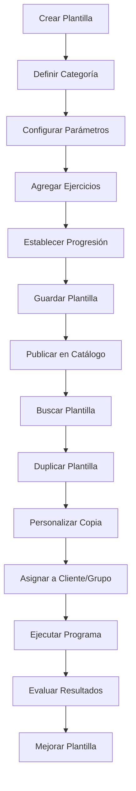
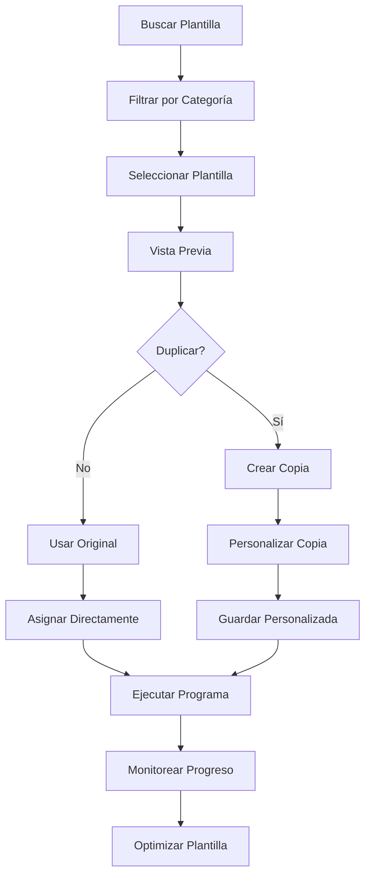

# Plantillas de Entrenamiento - Documentación Completa

**ID de la página:** 29706f76-bed4-8189-a930-caabbb355122

**URL:** https://www.notion.so/29706f76bed48189a930caabbb355122

**Fecha de extracción:** 2025-10-26 02:44:32

---

> 📋 Sistema de plantillas reutilizables de rutinas para estandarizar y escalar programas de entrenamiento

# Objetivo

Proporcionar un sistema completo de plantillas reutilizables de rutinas que permita crear, gestionar y reutilizar programas de entrenamiento estandarizados. Funcionalidades: catálogo reutilizable de rutinas tipo 'hipertrofia 12 semanas', 'pierna 2x/semana', duplicar y reutilizar plantillas. Útil tanto para entrenadores que escalan su servicio como para gimnasios que quieren estandarizar. El sistema debe permitir categorización, búsqueda y reutilización eficiente de plantillas exitosas.

# Diagramas de Flujo

## Flujo de Gestión de Plantillas



## Flujo de Reutilización



# Matrices de Recursos

## Funcionalidades Principales

- Catálogo de Plantillas: Biblioteca completa de rutinas reutilizables
- Creador de Plantillas: Herramienta para crear nuevas plantillas
- Duplicador de Plantillas: Sistema de copia y personalización
- Categorización: Organización por tipo de entrenamiento
- Búsqueda Avanzada: Filtros por categoría, duración, intensidad
- Gestión de Versiones: Control de versiones y actualizaciones
## Integraciones

- Editor de Entrenamiento: Creación de plantillas desde el editor
- Biblioteca de Ejercicios: Ejercicios disponibles para plantillas
- Sistema de Programas: Asignación de plantillas a programas
- Sistema de Progreso: Evaluación de efectividad de plantillas
- Sistema de Comunicaciones: Compartir plantillas entre usuarios
- Sistema de Analytics: Métricas de uso y efectividad
# User Stories

## Para Entrenadores Personales 🧍

- Como entrenador personal, quiero crear plantillas de rutinas exitosas para reutilizar
- Como entrenador personal, necesito duplicar plantillas y personalizarlas para cada cliente
- Como entrenador personal, debo poder categorizar plantillas por tipo de entrenamiento
- Como entrenador personal, quiero buscar plantillas por objetivos específicos
- Como entrenador personal, necesito escalar mi servicio con plantillas estandarizadas
- Como entrenador personal, debo poder compartir plantillas con otros entrenadores
## Para Gimnasios/Centros 🏢

- Como gimnasio, quiero estandarizar programas de entrenamiento para instructores
- Como centro, necesito crear plantillas para diferentes tipos de clases
- Como gimnasio, debo poder duplicar plantillas exitosas para nuevas clases
- Como centro, quiero categorizar plantillas por nivel de dificultad
- Como gimnasio, necesito gestionar versiones de plantillas para actualizaciones
- Como centro, debo poder analizar la efectividad de las plantillas
# Componentes React

- PlantillasList: Lista principal de plantillas disponibles
- CreadorPlantilla: Herramienta para crear nuevas plantillas
- DuplicadorPlantilla: Sistema de duplicación y personalización
- CategorizadorPlantillas: Organizador por categorías
- BuscadorPlantillas: Motor de búsqueda avanzada
- VisorPlantilla: Visor detallado de plantillas
- GestorVersiones: Control de versiones de plantillas
- AnalyticsPlantillas: Métricas de uso y efectividad
# APIs Requeridas

```bash
GET /api/entrenamiento/plantillas
POST /api/entrenamiento/plantillas
PUT /api/entrenamiento/plantillas/:id
DELETE /api/entrenamiento/plantillas/:id
POST /api/entrenamiento/plantillas/duplicar
GET /api/entrenamiento/plantillas/categorias
GET /api/entrenamiento/plantillas/buscar
POST /api/entrenamiento/plantillas/compartir
GET /api/entrenamiento/plantillas/analytics
```

# Estructura MERN

```bash
entrenamiento/plantillas/
├─ page.tsx
├─ api/
│  ├─ plantillas.ts
│  ├─ categorias.ts
│  └─ analytics.ts
└─ components/
   ├─ PlantillasList.tsx
   ├─ CreadorPlantilla.tsx
   ├─ DuplicadorPlantilla.tsx
   ├─ CategorizadorPlantillas.tsx
   ├─ BuscadorPlantillas.tsx
   ├─ VisorPlantilla.tsx
   ├─ GestorVersiones.tsx
   └─ AnalyticsPlantillas.tsx
```

# Documentación de Procesos

1. Se crea una nueva plantilla desde el editor de entrenamiento
1. Se define la categoría y parámetros de la plantilla
1. Se configuran los ejercicios, series y progresión
1. Se guarda la plantilla en el catálogo con metadatos
1. Se publica la plantilla para búsqueda y reutilización
1. Los usuarios buscan y filtran plantillas por categoría
1. Se duplica la plantilla y se personaliza según necesidades
1. Se asigna la plantilla a clientes o grupos
1. Se ejecuta el programa y se evalúa la efectividad
1. Se optimiza la plantilla basada en resultados
# Nota Final

> 💡 Las plantillas de entrenamiento son un activo reutilizable fundamental que permite escalar el servicio tanto para entrenadores personales como para gimnasios. El sistema de duplicación y personalización permite mantener la flexibilidad mientras se aprovecha la estandarización. La categorización y búsqueda avanzada facilitan la gestión de grandes catálogos de plantillas, mientras que el sistema de versiones y analytics permite la mejora continua basada en datos reales de uso y efectividad.

